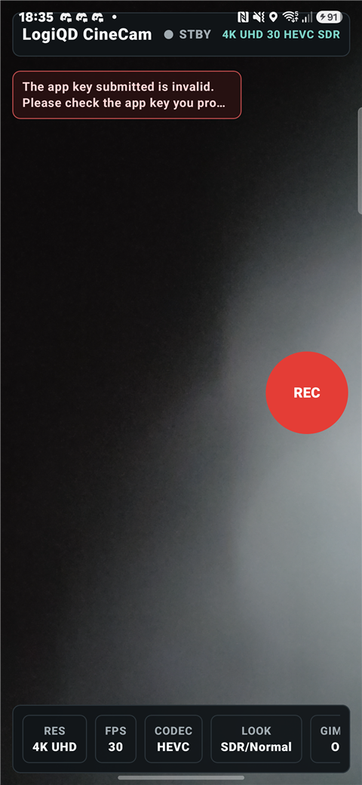

# DJICinemaMVP


An Android app that turns a Samsung Galaxy phone into a cinema camera physically controlled by a **DJI OM2/OM5 gimbal** over Bluetooth LE. The phone handles the imaging pipeline — real-time preview via CameraX and high-speed recording via the Camera2 API — while the gimbal's hardware controls (record button, zoom slider, joystick) drive the camera remotely through the DJI Mobile SDK, loaded entirely via Java reflection.

The project is an MVP built to explore the boundaries of Android's camera stack on Samsung devices: constrained high-speed capture sessions, runtime codec/dynamic-range capability detection, and hybrid CameraX/Camera2 operation where the preview and the recorder hand the camera device back and forth.

## Screenshot

<p align="center"></p>

> The cinema camera UI: live preview with resolution / fps / codec / look controls and the gimbal-driven REC button. The "invalid app key" banner appears only because this public build ships a placeholder DJI key — add your own (see Getting started).

## Features

- **Real-time preview** with CameraX (`PreviewView` hosted in Compose via `AndroidView`)
- **High-speed video recording up to 120 fps** using Camera2 `ConstrainedHighSpeedCaptureSession` with H.264/AVC and H.265/HEVC encoding, saved through MediaStore
- **Physical gimbal control**: start/stop recording, smooth hardware zoom, and gimbal rotation driven by DJI OM2/OM5 controls over BLE
- **Samsung capability detection**: background scan of camera IDs to discover supported resolutions, frame rates, codecs, and dynamic ranges (SDR / HLG10)
- **Portrait and landscape UI** built entirely in Jetpack Compose with a dark, cinema-style theme
- **Smooth zoom animation** (interpolated steps mapped from the gimbal's zoom slider events)

## Architecture

MVVM with a single `MainViewModel` that aggregates three independent repositories using Kotlin `combine()`, exposing one `AppUiState` through `StateFlow`.

```
app/src/main/java/com/cinemaapp/djimvp/
├── MainActivity.kt                  # ComponentActivity, setContent only
├── MainViewModel.kt                 # Combines camera + capabilities + DJI flows into AppUiState
├── state/
│   └── AppUiState.kt                # Single immutable UI state data class
├── camera/
│   ├── CameraRepository.kt          # Orchestrates CameraX preview + Camera2 recording
│   ├── Camera2HighSpeedRecorder.kt  # Full Camera2 pipeline: openCamera → session → MediaRecorder → MediaStore
│   └── SamsungCameraCapabilitiesRepository.kt  # Device camera capability scanning
├── dji/
│   ├── DjiRepository.kt             # Entire DJI SDK accessed via reflection; emits DjiControlEvent
│   ├── DjiManifestDiagnostics.kt    # API key diagnostics from the manifest
│   └── DjiSdkLoaderDiagnostics.kt   # DJI helper APK loader diagnostics
└── ui/
    ├── CineCamScreen.kt             # Complete Compose UI, portrait + landscape layouts
    ├── CameraPreview.kt             # AndroidView wrapper for CameraX PreviewView
    └── theme/                       # Dark cinema theme (dynamicColor disabled)
```

Key design points:

- **Hybrid camera pipeline**: CameraX is used only for preview. When recording starts, CameraX unbinds, Camera2 takes over the device for high-speed capture, and the preview is rebound to CameraX when recording stops.
- **DJI SDK via reflection**: the SDK is invoked with `Class.forName` + `Proxy.newProxyInstance` against its obfuscated helper classloader, keeping the app decoupled from SDK classes at compile time.
- **Event-driven control**: `DjiRepository` emits `DjiControlEvent`s (record, zoom in/out, gimbal rotation) on a `SharedFlow`; the ViewModel maps them to camera actions.

## Tech Stack

| Layer | Technology |
|---|---|
| Language | Kotlin |
| UI | Jetpack Compose (Material 3), portrait + landscape |
| Preview | CameraX (core, camera2, lifecycle, view) |
| Recording | Camera2 API + MediaRecorder + MediaStore |
| State | ViewModel + StateFlow / SharedFlow, MVVM |
| Gimbal | DJI Mobile SDK 4.18 (loaded via Java reflection), Bluetooth LE |
| Build | Gradle (Kotlin DSL), version catalog, ABI splits (armeabi-v7a, arm64-v8a) |
| SDK levels | minSdk 24 · target/compileSdk 34 · Java 11 |

## Getting Started

### Prerequisites

- Android Studio with an Android SDK (API 34)
- A DJI developer API key — create an app at [developer.dji.com](https://developer.dji.com) to obtain one
- A Samsung Galaxy device (capability detection is tuned for Samsung) and a DJI OM2 or OM5 gimbal

### Build

```bash
git clone https://github.com/<your-username>/DJICinemaMVP.git
cd DJICinemaMVP
```

Create a `local.properties` file in the project root (see `local.properties.example`):

```properties
sdk.dir=/path/to/android/sdk
DJI_API_KEY=your_dji_api_key_here
```

The build fails fast if `DJI_API_KEY` is missing — the key is injected into the manifest as a placeholder and never committed.

Then build and install:

```bash
./gradlew assembleDebug
./gradlew installDebug
```

## Known Limitations

- **AV1 recording is not functional**: AV1 appears in capability scans but `MediaRecorder` cannot start an AV1 session on Samsung devices; a `MediaCodec`+`MediaMuxer` pipeline is planned.
- **No settings persistence**: recording settings reset on app restart (DataStore integration pending).
- **HDR10 / Dolby Vision not implemented** — only SDR and HLG10 dynamic ranges are supported.
- **Fragile DJI integration**: the reflection bridge depends on an obfuscated DJI helper class name and may break with DJI SDK updates.
- **Memory leak on rotation**: the camera repository holds strong references to the lifecycle owner/preview view (WeakReference fix pending).
- **UI status/error messages are hardcoded in Spanish** (no i18n yet).

See [docs/](docs/README.md) for the full bug and improvement backlog, and [AI.md](AI.md) for an AI-oriented technical map of the codebase.

## License

[MIT](LICENSE) © 2026 Gerard Alvear
